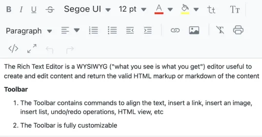

# Multi-Board-Semi-Project

# Node.js 게시판 모듈
## 1. Rich Text Editer 모듈
### Rich Text Editer란?
텍스트에 글꼴, 색상, 크기, 링크 등 다양한 스타일을 적용할 수 있는 WYSIWYG(What You See Is What You Get) 편집기입니다.

### Rich Text Editer 종류
| **에디터**    | **특징**                                                    |
|---------------|-----------------------------------------------------------|
| Lexical       | Facebook 개발, React와 함께 확장성이 뛰어난 에디터 프레임워크   |
| Quill         | 사용이 간편하고 커스터마이징이 용이한 WYSIWYG 편집기         |
| TinyMCE       | 다양한 기능과 플러그인을 제공하는 인기 있는 에디터            |
| CKEditor      | 플러그인 기반의 강력한 기능 제공                          |
| Draft.js      | React 기반으로 Facebook에서 개발된 텍스트 에디터             |
| ProseMirror   | 모듈식 구조로 복잡한 커스텀 에디터를 만들기에 적합한 툴킷      |

## 2. Mark Down Editor 모듈
### Mark Down Editor란?
간결한 마크다운 문법을 사용해 작성된 내용을 HTML로 변환해주는 텍스트 편집기입니다.
### Mark Down Editer 종류
| **모듈**                  | **특징**                                               |
|---------------------------|--------------------------------------------------------|
| react-markdown            | React에서 마크다운 렌더링을 지원                        |
| react-markdown-editor-lite| 실시간 미리보기를 제공하는 React 기반 마크다운 편집기     |
| draft-js                  | 복잡한 텍스트 편집 기능을 제공, 마크다운 구현 가능         |
| react-draft-wysiwyg       | Draft.js 기반, 직관적인 WYSIWYG 에디터                  |
| react-quill               | 리치 텍스트 에디터로 마크다운 지원 가능                 |
| slate                     | 고급 사용자 정의를 제공하는 고급 텍스트 편집기           |
| marked                    | 마크다운을 HTML로 변환하는 서버 사이드 렌더링 패키지      |

## 3. PDF Viewer 모듈
### PDF Viewers란?
PDF 파일을 브라우저 또는 애플리케이션에서 렌더링하고 표시하는 기능을 제공합니다.
### PDF View 종류
| **모듈**      | **특징**                                            |
|---------------|-----------------------------------------------------|
| pdfjs-dist    | PDF.js 기반, 직접 PDF 파일 렌더링이 가능한 패키지     |
| react-pdf     | React 프로젝트에서 쉽게 PDF 파일 표시를 지원           |

## 4. Excalidraw 모듈
### Excalidraw Editor란?
웹 기반의 화이트보드 및 다이어그램 생성 도구입니다. React 애플리케이션에서 쉽게 통합 가능합니다.
### Excalidraw 에디터 설치 방법
- `npm install react react-dom @excalidraw/excalidraw`

## 5. Draw.io 모듈
### Drawio Editor란?
플로우차트, UML 다이어그램 등 그래프 기반의 다이어그램을 쉽게 그릴 수 있는 도구입니다.
### Drawio Editor 종류
| **모듈**                  | **특징**                                             |
|---------------------------|------------------------------------------------------|
| embed-drawio              | 독립적으로 Draw.io 임베딩 및 통신 솔루션 제공           |
| @zklogic/draw.io          | Angular 프로젝트용 Draw.io 통합 기능                   |
| mermaid                   | 텍스트 기반으로 다이어그램을 생성하는 대안 라이브러리    |

# 유형별 게시판 UI
*게시판은 이미 많은 웹 서비스에서 구현된 기능이다. 즉, 게시판 기능을 향상시킬 수 있는 가장 좋은 방법은 다른 사이트를 참고하는 것이다.*

*필요에 맞게, 참고하려는 게시판의 성격에 따라, 말 그대로 보이는 모든 카테고리와 데이터들을 식별하고 JSON 형식으로 가져오는 과정을 수행해본다*

이 과정은 직접 분석하는 것도 좋지만, GPT 등을 이용해서 먼저 어떤 구조로 가져올 수 있는지 이해 하는 게 중요.

---
게시판 기능은 웹 서비스의 핵심입니다.
아래 다양한 유형의 게시판을 참고하여 적절한 UI와 기능을 도입할 수 있습니다.

- 지식형 게시판 (Medium 참고)

    
- 블로그형 게시판 (Naver Blog 참고)

    
- Cafe형 게시판 (Daum Cafe 참고)
